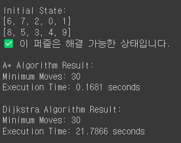
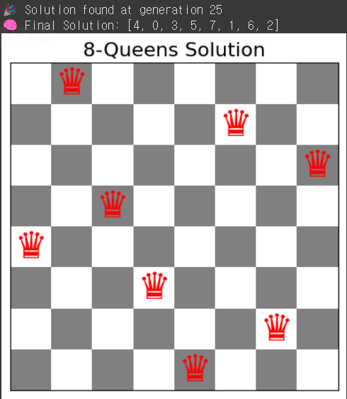

4-1학기 AI-Python 과제들 목차
=============================

1. 2*5 Puzzle
2. 8 Queens Puzzle(Genetic Algorithm)


2*5 Puzzle
----------
<details>
<summary>펼치기</summary>


# 🧩 2x5 퍼즐 문제 - A* & 다익스트라 알고리즘

> 2행 5열(총 10칸)의 퍼즐을 **A\*** 및 **다익스트라(Dijkstra)** 알고리즘으로 해결하는 Python 구현입니다.

---

## 📌 문제 설명

- 퍼즐 형태: 2행 × 5열 (총 10개의 숫자 블록: 1~9 + 빈칸(0))
- 목표 상태:
  ```
  [[1, 2, 3, 4, 5],
   [6, 7, 8, 9, 0]]
  ```

- 각 숫자는 상하좌우로 이동 가능하며, 빈칸과 자리를 교체함으로써 퍼즐을 풀어감

---

## ⚙️ 주요 기능

### ✅ 상태 표현 및 조작
- 퍼즐 상태는 2차원 리스트로 표현
- 상태를 튜플로 변환하여 `set`에 저장 (중복 방지)
- `flatten(state)`로 1차원 변환 → **inversion count**를 통해 풀 수 있는 퍼즐인지 판단

### ✅ 이동 방향
```python
MOVES = [(-1, 0), (1, 0), (0, -1), (0, 1)]  # 상, 하, 좌, 우
```

---

## 🚀 알고리즘 설명

### A* (A-Star) 알고리즘
- `f = g + h` 방식 사용
- `g`: 이동 횟수 (깊이)
- `h`: 휴리스틱 (맨해튼 거리)

### Dijkstra 알고리즘
- `f = g` 만 사용하는 단순 최단 거리 탐색
- 두 알고리즘 모두 우선순위 큐(힙)를 사용

---

## 🔍 주요 함수

| 함수 이름 | 설명 |
|-----------|------|
| `is_solvable(state)` | 퍼즐이 풀 수 있는 상태인지 검사 |
| `manhattan_distance(state)` | 휴리스틱 계산 (A*용) |
| `search_puzzle_algorithm(state, search_type='a_star')` | 퍼즐 탐색 함수 (A* 또는 Dijkstra) |
| `generate_random_state()` | 무작위 퍼즐 상태 생성 |

---

## 🧪 실행 예시

```bash
python 2x5_puzzle_ai.py
```

### 출력 예시:
```
Initial State:
[6, 3, 1, 4, 0]
[7, 8, 2, 9, 5]
✅ 이 퍼즐은 해결 가능한 상태입니다.

A* Algorithm Result:
Minimum Moves: 22
Execution Time: 0.0123 seconds

Dijkstra Algorithm Result:
Minimum Moves: 22
Execution Time: 0.0548 seconds
```

---

## 📚 참고

- 알고리즘: A*, Dijkstra
- 언어: Python 3.x
- 구조: 우선순위 큐, 휴리스틱 탐색
- 퍼즐 유형: 2x5 슬라이딩 퍼즐

---

## 🖼️ 결과 이미지

아래는 코드 실행 결과입니다:



---


</details>

8 Queens Puzzle(Genetic Algorithm)
----------
<details>
<summary>펼치기</summary>

# ♛ 8 Queens Problem - Genetic Algorithm in Python

> 서로 공격하지 않는 8개의 퀸을 체스판에 배치하는 문제를 **유전자 알고리즘**으로 해결합니다.

---

## 📌 문제 설명

- 체스판 크기: 8 x 8
- 퀸은 같은 **행, 열, 대각선**에 있으면 서로 공격함
- 목표: 퀸 8개를 **서로 공격하지 않도록 배치**

---

## 🧬 유전자 알고리즘 구성

### 🧠 개체 표현 (Chromosome)

```python
individual = [row_0, row_1, ..., row_7]
```

- 인덱스 = 열(column), 값 = 퀸의 행(row)
- 예시: `[0, 4, 7, 5, 2, 6, 1, 3]` → (0,0), (1,4), ..., (7,3)

---

### 🎯 적합도 함수 (Fitness Function)

```python
calculate_fitness(individual)
```

- 퀸들 간 **충돌하지 않는 쌍의 수**로 계산
- 전체 쌍의 수 = 28 (8C2)
- 적합도 = `28 - 공격 중인 쌍의 수`
- 완벽한 해 = `fitness == 28`

---

### 🔁 주요 연산

| 연산         | 설명 |
|--------------|------|
| `selection()`  | 적합도 기반 룰렛 휠 선택 |
| `crossover()`  | 단일 분할점 교차 |
| `mutate()`     | 낮은 확률로 퀸 위치 돌연변이 |
| `elitism`      | 상위 10% 개체 유지 |

---

## 📈 세대별 적합도 출력

```python
print(f"Generation {generation}: Best Fitness = {best_fitness}")
```

- 각 세대마다 최고 적합도 출력
- 진화 진행 상황 확인 가능

---

## 🎨 시각화 (matplotlib)

```python
draw_board(solution)
```

- 체스판을 그리고 `♛` 문자로 퀸 위치 표시
- `matplotlib`로 GUI로 시각적 출력

### 설치:

```bash
pip install matplotlib
```

---

## 🧪 실행 방법

1. 코드 저장 (`eight_queens_ga.py`)
2. 실행

```bash
python eight_queens_ga.py
```

3. 출력 예시:

```
🎉 Solution found at generation 6
🧠 Final Solution: [0, 4, 7, 5, 2, 6, 1, 3]
```

---

## 📁 주요 함수 요약

```text
- generate_individual()   # 초기 개체 생성
- calculate_fitness()     # 적합도 계산
- selection()             # 부모 선택
- crossover()             # 교차
- mutate()                # 돌연변이
- genetic_algorithm()     # 메인 반복 로직
- draw_board()            # 체스판 시각화
```

---

## 📚 참고

- 알고리즘: Genetic Algorithm
- 언어: Python 3.x
- 시각화: matplotlib
- 문제 유형: 최적화, 제약 조건 만족 문제 (Constraint Satisfaction)

---

## 🖼️ 결과 이미지

아래는 유전자 알고리즘으로 찾은 8-Queens 해를 시각화한 결과입니다:



---

</details>
